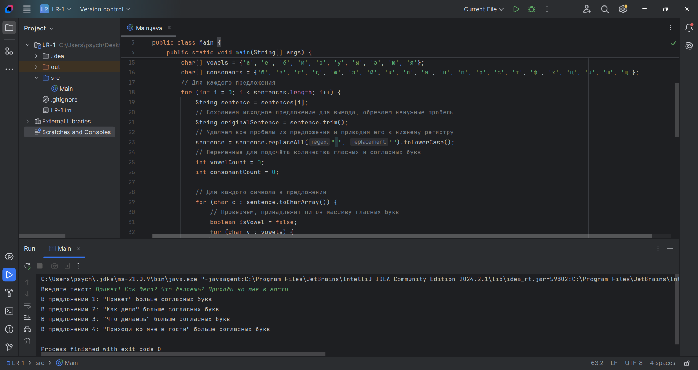

# Лабораторная работа №1
По дисциплине "Объектно-ориентированное программирование", 3 семестр.

Выполнила студентка группы ПИН-232 Корноухова Маргарита.

**Вариант 10.** Найти, каких букв, гласных или согласных, больше в каждом предложении текста.

